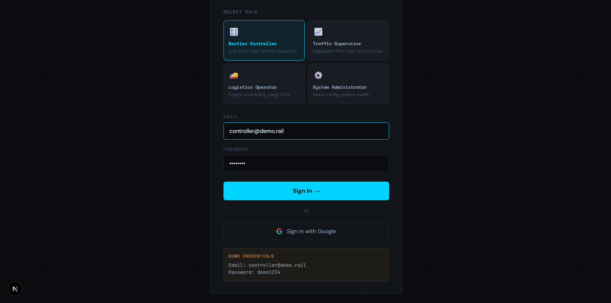
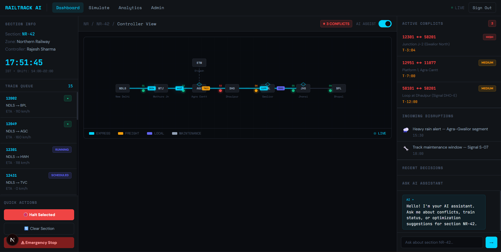
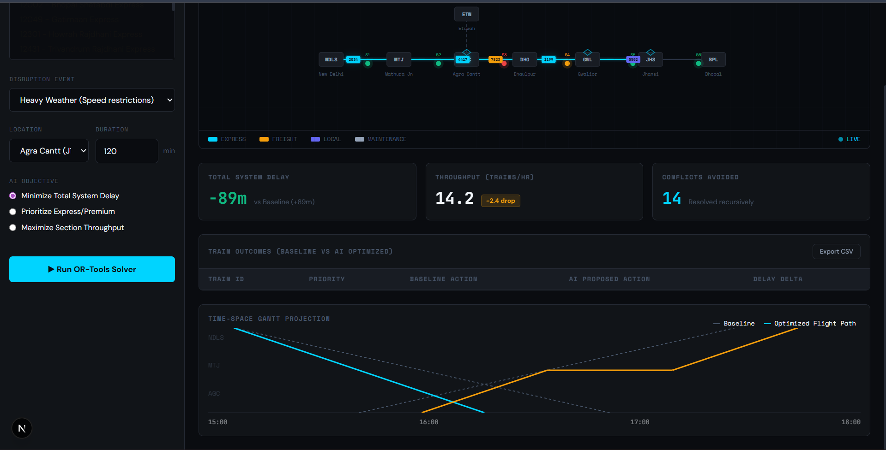
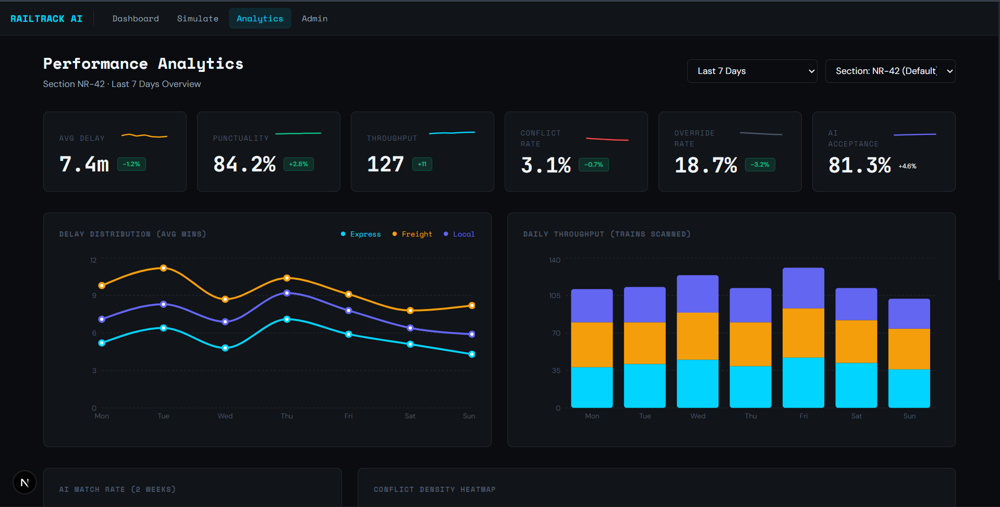

<div align="center">
  <h1>RailTrack AI</h1>
  <p><em>AI-powered railway traffic decision support system for Indian Railways section controllers. Built with OR-Tools CP-SAT, FastAPI, and Next.js.</em></p>

  []()
  [](https://opensource.org/licenses/MIT)
</div>

AI-powered railway traffic decision support system for Indian Railways section controllers. Built with **OR-Tools CP-SAT**, **FastAPI**, and **Next.js**.

---

## Screenshots

<div align="center">
  <figure>
    
    <figcaption>Role-based login with Google OAuth</figcaption>
  </figure>
  <br/>
  <figure>
    
    <figcaption>Live controller dashboard with real-time train map</figcaption>
  </figure>
  <br/>
  <figure>
    
    <figcaption>OR-Tools CP-SAT conflict resolution results</figcaption>
  </figure>
  <br/>
  <figure>
    
    <figcaption>Performance analytics dashboard</figcaption>
  </figure>
</div>

---

## Key Features

<table width="100%">
  <tr>
    <td width="33%">🚆 Real-time train tracking on NR-42 corridor</td>
    <td width="33%">🤖 AI conflict detection & resolution</td>
    <td width="33%">⚡ <b>Google OR-Tools CP-SAT v9.x</b> precedence optimization</td>
  </tr>
  <tr>
    <td width="33%">📊 Performance analytics & KPI dashboards</td>
    <td width="33%">👥 Role-based access (Admin/Controller/Supervisor/Logistics)</td>
    <td width="33%">🔐 <b>JWT</b> auth + <b>Google OAuth</b></td>
  </tr>
  <tr>
    <td width="33%">📧 Email invite system (<b>Resend API</b>)</td>
    <td width="33%">🏥 Real-time system health monitoring</td>
    <td width="33%">🔌 IRCTC live train data integration</td>
  </tr>
  <tr>
    <td width="33%">📡 WebSocket live telemetry</td>
    <td width="33%">🚫 403 guard for non-admin routes</td>
    <td width="33%">🌐 Modern web dashboard UI</td>
  </tr>
</table>

---

## Architecture Diagram

```ascii
Browser (Next.js 16.1.6) ──── REST + WebSocket ────► FastAPI (Python 3.11)
                                                        │          │
                                                    PostgreSQL   OR-Tools
                                                                CP-SAT v9.x
                                                        │
                                                    IRCTC Live Feed
                                                    Resend Email API
```

---

## Demo Credentials

> **Note**: Test the application using the credentials below to explore different dashboards.
> 
> | Role | Email | Password | Access Description |
> |------|-------|----------|--------------------|
> | Admin | admin@demo.rail | demo1234 | Full system configuration and user management. |
> | Controller | controller@demo.rail | demo1234 | Traffic monitoring and AI conflict resolution. |
> | Supervisor | supervisor@demo.rail | demo1234 | System analytics and high-level reports. |
> | Logistics | logistics@demo.rail | demo1234 | Freight scheduling and delayed train tracking. |

---

## Quick Start

<details>
<summary><b>Click to expand local setup instructions</b></summary>

### Prerequisites

- Node.js (for Next.js frontend)
- **Python 3.11** (for backend)
- **SQLite / PostgreSQL** database

### 1. Backend Setup

```bash
cd backend
python -m venv venv
source venv/bin/activate  # On Windows: venv\Scripts\activate

# Install requirements including SQLAlchemy async and asyncpg
pip install -r requirements.txt
cp .env.example .env

# Run database migrations
alembic upgrade head

# Start FastAPI server
uvicorn main:app --reload
```

### 2. Frontend Setup

```bash
cd railtrack-ai
npm install

cp .env.example .env.local

# Start Next.js development server
npm run dev
```

</details>

---

## API Reference

| Method | Path | Auth Required | Description |
|--------|------|---------------|-------------|
| `POST` | `/api/auth/login` | No | Authenticate user and issue JWT |
| `GET`  | `/api/trains/live/{train_no}` | Yes | Retrieve real-time train positions from IRCTC |
| `POST` | `/api/solver/run` | Yes (Controller) | Execute Google OR-Tools CP-SAT resolution |
| `GET`  | `/api/analytics/kpis` | Yes (Admin/Supervisor) | Fetch performance analytics data |
| `GET`  | `/ws/telemetry` | Token in query | WebSocket endpoint for live map updates |

---

## About RailTrack AI

RailTrack AI is an enterprise-grade railway traffic management and decision support platform designed for Indian Railways section controllers. It integrates real-time telemetry, Google OR-Tools CP-SAT constraint programming, and interactive analytics to streamline train dispatching, reduce section delays, and resolve track conflicts.

---

## License

MIT
